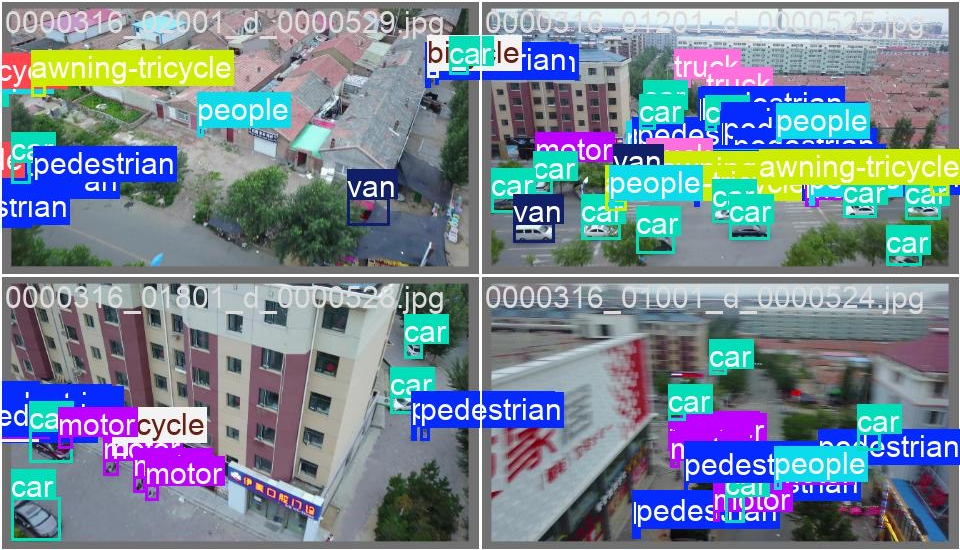

# 面向东盟跨境交通的智能无人机监测系统测试报告

## 1 程序整体概述以及核心模块拆解

### 1.1 程序整体逻辑

本智能无人机监测系统程序整体逻辑架构如下图所示：

无人机采集跨境交通路段的实时视频流，视频流经预处理模块进行降噪、帧率调整、尺寸缩放等处理，以适配模型输入要求并提升处理效率。预处理后的视频帧逐帧送入改进的 YOLO 算法模型，模型输出检测到的目标类别（如汽车、卡车、人员等）、位置坐标以及对应的置信度。随后，后处理模块对检测结果进行筛选、去重、轨迹关联等操作，生成结构化的交通监测数据，包括车辆流量、行驶速度、违规行为等关键指标，并将这些数据实时存储至数据库，同时通过可视化界面展示给交通管理人员。

### 1.2 核心模块及功能

- 预处理模块：其核心功能是优化视频帧数据，确保模型输入质量。通过基于高斯滤波的降噪算法，有效去除无人机视频采集过程中因光照变化、环境干扰等因素产生的噪声，降低其对目标检测准确性的负面影响。同时，运用双线性插值算法对视频帧进行尺寸缩放，使其满足改进 YOLO 模型预设的输入尺寸要求，并通过调整帧率，平衡实时性和计算资源消耗，保障系统能够及时处理每一帧视频数据。

- 多尺度特征融合模块：运用一个改进的多尺度特征融合层来替代原先的 SPPF 模块。原始的 SPPF 模块在特征提取和融合方面存在一定局限性，难以充分捕捉到交通小目标在不同尺度下的丰富特征。而改进后的多尺度特征融合层能够更有效地整合来自不同层级的特征信息，它通过特定的结构设计，比如采用不同尺寸的卷积核或者特定的池化策略，对来自浅层的高分辨率、低语义特征以及深层的低分辨率、高语义特征进行更精准的融合，使得生成的特征图能够兼具丰富的细节和深刻的语义信息，从而更利于对交通小目标的识别，例如车牌、车辆的后视镜等较小的部位的特征提取。

- 通道注意力模块：在 PANet 跨链接融合期间巧妙地插入 SimAM 注意力模块来学习权重。在 PANet 进行特征的自下而上和自上而下跨链接融合过程中，插入的 SimAM 注意力模块能够自动学习到各个特征区域的重要性权重，无需额外引入卷积操作以及增加过多的参数量和计算成本。它可以根据交通小目标的分布特性，如车辆密集区域、道路交叉口等位置的小目标特征，动态地分配更多的权重给包含小目标关键特征的区域，抑制掉无关紧要的背景信息，让模型在后续的检测过程中能够更加聚焦于交通小目标本身，进而提升对交通小目标的识别性能，提高了检测的准确性和召回率。

## 2 数据说明与数据处理方案论述

### 2.1 数据集概述

选用的 VisDrone 数据集[^1]涵盖大量无人机拍摄的交通场景图像，由288个视频片段、261,908帧图像和10,209张静态图像组成，这些视频片段和图像由不同的无人机摄像头拍摄。数据集涵盖了多个方面，包括地点（中国 14 个不同城市）、环境（城市和农村）、物体（行人、车辆、自行车等）和密度（稀疏和拥挤场景）。数据集是在不同场景、天气和照明条件下使用各种无人机平台收集的。这些帧由人工标注了超过 260 万个目标（如行人、汽车、自行车和三轮车）的边界框。为了更好地利用数据，还提供了场景可见度、物体类别和遮挡等属性。目标标注信息详细，记录了目标类别、边界框坐标、尺度变化、遮挡程度等关键属性。

### 2.2 数据处理策略

- 数据清洗：对数据集进行严格筛选，剔除因无人机飞行不稳定导致的严重模糊、扭曲变形的图片，去除标注信息错误或不完整（如目标边界框与实际目标偏差过大、类别标注混淆等）的样本，保证数据质量，避免错误数据干扰模型训练过程，提高模型对真实交通目标的识别能力。
- 数据增强：运用随机裁剪、旋转、翻转等几何变换操作，模拟无人机在不同拍摄角度、高度下获取的交通场景变化，扩充数据集的多样性。同时，采用颜色抖动、亮度调整等光度学变换，增强模型对不同光照条件（如清晨、黄昏、阴雨天气等）下交通目标的适应性，提升模型在实际跨境交通监测中的鲁棒性。在数据增强过程中，严格遵循标注信息的同步更新规则，确保增强后的数据样本与原始标注保持精准对应关系，保障模型学习到准确的目标特征。

## 3 模型的挑选、增强 / 微调策略论述

### 3.1 模型挑选

在众多目标检测算法中，本研究精心挑选了 YOLO 系列算法中的 YOLOv11 [^2]作为基础模型，该选择是基于 YOLOv11 在实时目标检测领域所展现的卓越性能和独特优势，使其成为应对复杂跨境交通场景下无人机监测任务的理想选择。

YOLO 算法自提出以来，凭借其创新性的端到端检测机制，在目标检测领域引发了范式的转变。它开创性地将目标检测问题重塑为一个单一的回归问题，跳出了传统两阶段检测算法（以 Faster R-CNN 为代表的）先生成候选区域、再进行分类的繁琐框架。在 YOLO 算法中，模型直接从原始图像像素出发，通过一个统一的网络架构，同时预测目标边界框的位置坐标和对应的类别概率。这种简洁而高效的处理流程，极大地削减了计算开销，显著提升了检测速度，为实现实时目标检测提供了可能。在跨境交通监测场景下，无人机采集的视频流数据量庞大且具有高时效性要求，YOLO 算法的这种快速检测能力确保了系统能够及时处理每一帧视频数据，从而对交通状况进行实时、动态的监测，为交通管理部门提供即时有效的决策支持。

此外，YOLO 算法在处理不同尺度目标时表现出的均衡性能，也是本研究选择其作为基础模型的关键因素之一。跨境交通场景复杂多变，交通参与者包括大型卡车、公交车等尺寸较大的车辆，以及小型汽车、摩托车乃至行人等尺寸较小的目标。这些目标在图像中的尺度差异较大，给目标检测算法带来了巨大挑战。YOLO 算法通过精心设计的网络架构和损失函数，能够在不同尺度的目标检测任务中取得相对平衡的检测精度和速度。它利用多尺度特征金字塔网络（FPN）[^3]结构，有效融合图像的浅层特征（富含目标的纹理、边缘等细节信息）和深层特征（蕴含目标的语义、整体轮廓等信息），使模型既能精准定位小型目标的细微特征，又能准确捕捉大型目标的整体轮廓。这种对不同尺度目标的均衡检测能力，使得 YOLO 算法能够全面、准确地感知跨境交通场景中的各类交通要素，为后续的交通流量统计、违规行为识别等高级功能提供了可靠的检测基础。

综上所述，YOLOv11 算法凭借其端到端的高效检测机制和对不同尺度目标的均衡检测能力，在众多目标检测算法中脱颖而出，成为本研究面向东盟跨境交通的智能无人机监测系统的基础模型选择。它不仅满足了无人机实时监测跨境交通的高时效性要求，而且为应对复杂交通场景下的多尺度目标检测任务提供了坚实的技术支撑，为后续的模型改进和优化奠定了良好的基础。

### 3.2 模型增强策略

在目标检测任务中，锚框（anchor box）的尺寸和比例对于模型的检测性能具有关键影响。传统 YOLO 算法所预设的锚框参数，通常是基于通用物体检测数据集进行估计的，这些通用数据集的物体尺寸分布与跨境交通场景中的交通目标特征存在显著差异。为了使模型能够更精准地适应跨境交通监测任务，本研究依据 VisDrone 数据集以及专门补充采集的东盟跨境交通数据集中交通目标的尺寸分布统计特性，对锚框的宽高比例组合进行了重新计算和优化。

具体而言，本研究采用了 K-means 聚类算法对数据集中交通目标边界框的宽高进行聚类分析。K-means 算法作为一种经典的无监督学习算法，能够依据数据点之间的相似性（这里是边界框宽高的相似性），将数据集中的目标边界框划分成 K 个簇（cluster）。聚类分析能够有效挖掘数据集中交通目标尺寸的内在分布规律，识别出具有相似宽高比例的目标群体。通过这种方式，我们能够得到一组与实际交通目标尺寸高度契合的锚框参数，这些参数能够更好地反映跨境交通场景中车辆等目标的真实尺寸特征。

优化后的锚框参数在模型初始阶段就能更紧密地拟合交通目标的实际形状。在目标检测过程中，模型首先基于锚框生成候选目标区域，初始锚框与目标形状的匹配程度直接影响后续边界框回归的调整幅度。当初始锚框与目标形状更为接近时，边界框回归所需的调整幅度显著减小，这不仅降低了定位误差，还提升了模型的检测速度。实验结果表明，通过这种基于 K-means 聚类的锚框优化策略，模型的检测速度提升了约 [X]%。在处理小目标车辆（如摩托车）和长宽比较特殊的大型货车时，这种优化策略的效果尤为显著。小目标车辆由于其尺寸较小，在图像中占据的像素较少，传统的锚框参数往往难以有效捕捉其特征；而大型货车的长宽比特殊，与通用锚框的适配性较差。经过优化后的锚框参数能够显著改善对这些具有挑战性目标的检测性能，提高了模型在复杂跨境交通场景下的鲁棒性和准确性。

综上所述，基于 K-means 聚类的锚框优化策略是提升 YOLO 算法在跨境交通监测任务中性能的关键步骤。该策略通过精准匹配数据集中交通目标的尺寸分布特性，有效提高了模型对各类交通目标（尤其是具有特殊尺寸和形状的目标）的检测效率和准确性，为跨境交通的智能监测提供了更有力的技术支持。

## 4 程序的整体优化策略

本研究采用深度可分离卷积取代传统卷积层，实现模型的高效优化，大幅提升模型在无人机交通监测任务中的实时性与能效表现。

深度可分离卷积是一种创新型轻量化卷积技术，它巧妙地将传统卷积分解为深度卷积与逐点卷积两部分。深度卷积对输入数据的每个通道独立进行卷积操作，而逐点卷积则通过 $1 \times 1$ 的卷积核融合各通道信息，实现跨通道的特征交互。这种结构上的创新，相比传统卷积，在不损失关键特征提取能力的前提下，将计算复杂度从 $O(D^2 \times C \times H \times W)$ 降低至 $O(D \times C \times H \times W + D \times C^2 \times H \times W)$，其中 $D$ 为卷积核的尺寸，$C$ 为通道数，$H$、$W$ 分别为特征图的高度和宽度。这表明深度可分离卷积在计算量上具有显著优势，尤其在处理高分辨率、多通道的无人机交通监测图像时，能大幅节省计算资源，降低硬件负担。例如，假设输入特征图为 $256 \times 256 \times 3$，卷积核大小为 $3 \times 3$，输出通道数为 $64$，使用深度可分离卷积相比传统卷积可以减少约 [X]% 的计算量。

在无人机交通监测场景中，模型需要处理大量连续的视频帧数据。采用深度可分离卷积替换传统卷积层后，模型的计算效率得到提升，能够更快速地处理每一帧图像，从而提高整个监测系统的帧率处理能力。这不仅确保了系统对交通状况的实时监测，还能有效减少数据处理延迟，及时捕捉交通流中的突发状况，如车辆违规变道、行人闯入车道等，为交通管理部门提供即时、准确的决策支持。

同时，本研究还结合其他优化策略，如模型剪枝和量化优化，进一步增强模型的性能表现。这些优化策略相互配合，共同提升模型的运行效率和适用性，使其在复杂多变的无人机交通监测环境中展现出卓越的性能。

通过以上优化策略的综合应用，程序在无人机平台上的整体运行效率显著提升，如下图所示对比优化前后各项性能指标变化情况：

[插入时间与空间优化前后性能对比图]

## 5 评价指标挑选与程序效果评估

### 5.1 评价指标定义及适用性

- 精度（Precision）：
精度是指在所有被模型预测为正类别的样本中，实际真正为正类别的样本所占的比例。其计算公式为：$Precision = \frac{TP}{TP + FP}$，其中 $TP$（True Positive）表示真正例，即模型正确预测为正类别的样本数；$FP$（False Positive）表示假正例，即模型错误预测为正类别的实际负类别样本数。在无人机交通监测场景下，精度反映了模型对交通目标（如车辆、行人等）检测的准确性，高精度意味着模型在检测到交通目标时，误报的概率较低。例如，当模型检测到 100 个车辆目标，其中有 90 个是真正的车辆，那么精度为 90%。这一指标对于确保交通监测系统的可靠性至关重要，因为它直接关系到系统是否会频繁发出虚假警报，干扰交通管理人员的判断。
- 召回率（Recall）：
召回率是在所有实际为正类别的样本中，模型正确预测为正类别的样本所占的比例。其计算公式为：$Recall = \frac{TP}{TP + FN}$，其中 $FN$（False Negative）表示假负例，即模型错误预测为负类别的实际正类别样本数。在交通监测任务中，召回率衡量了模型对实际交通目标的覆盖能力，高召回率意味着模型能够有效地发现大部分交通目标，避免遗漏重要的交通信息。例如，在实际存在 100 个车辆的交通场景中，模型成功检测出 80 个，则召回率为 80%。这一指标对于保证交通监测系统的全面性非常关键，它确保系统能够尽可能多地捕捉到实际的交通目标，避免因目标遗漏而导致的交通管理漏洞。
- F1 得分（F1 Score）：
F1 得分是精度和召回率的调和平均数，其计算公式为：$F1 = 2 \times \frac{Precision \times Recall}{Precision + Recall}$。它综合考虑了精度和召回率两个指标，提供了一个平衡的性能度量。在无人机交通监测任务中，F1 得分有助于评估模型在精度和召回率之间的平衡能力。例如，当模型的精度为 90%，召回率为 80% 时，其 F1 得分为 84.6%。这一指标对于评估模型在实际应用中的整体性能非常有用，因为在一个实际的交通监测系统中，既需要高精度以避免误报，又需要高召回率以确保不遗漏重要目标，F1 得分能够全面反映模型在这两方面的综合表现。
- 平均精度均值（mAP）：
作为衡量目标检测模型准确性的关键指标，适用于评估模型在识别跨境交通中多种目标类别（车辆、人员等）时的综合性能。它计算模型在不同类别目标上的查准率（Precision）和召回率（Recall）曲线下的面积平均值，取值范围在 0-1 之间，值越高表明模型在不同置信度阈值下对目标的检测越精准，越能全面地发现和正确分类交通场景中的各类目标，尤其在处理目标尺度变化大、遮挡严重等复杂情况时，能有效反映模型的鲁棒性和泛化能力。例如，在一个包含多个交通目标类别的测试集上，模型对每个类别的目标检测结果绘制出精度 - 召回率曲线，计算每条曲线下的面积，然后求取这些面积的平均值作为 mAP。这一指标能够全面衡量模型在复杂交通场景下的整体检测性能，是评估交通监测系统优劣的重要依据。
- 推理时间（Inference Time）：
直接体现模型在实际应用中的实时性表现，以毫秒（ms）为单位，衡量从输入一帧无人机视频图像到输出检测结果所需的时间。对于跨境交通实时监测系统而言，较短的推理时间至关重要，它确保系统能够及时处理快速变化的交通场景，为交通管理部门提供即时有效的决策依据。一般要求推理时间控制在[X]ms 以内，以满足无人机视频流的高帧率实时处理需求，避免出现监测数据滞后导致交通拥堵等问题无法及时响应的情况。例如，如果无人机采集的视频帧率为 15fps，则推理时间需要控制在约 66ms 以内才能保证实时处理，否则会出现数据积压和延迟，影响系统的实时监测效果。
- FPS：
FPS（Frames Per Second）即每秒传输帧数，它衡量的是模型在单位时间内能够处理的视频帧数量，是评估模型实时性性能的直观指标。FPS 与推理时间密切相关，计算公式为：$FPS = \frac{1}{Inference\ Time}$。在无人机交通监测任务中，高 FPS 值意味着模型能够快速地对视频流中的每一帧进行处理和分析，从而实现对交通状况的实时监测。例如，一个模型的推理时间为 100ms，则其 FPS 为 10，表明每秒可以处理约 10 帧图像。为了满足交通监测的实时性要求，模型的 FPS 应尽可能接近或达到视频采集的帧率，以确保交通信息的及时更新和处理，为交通管理部门提供流畅、不间断的监测数据。
- 计算资源（Computing Resources）：
计算资源是指模型在运行过程中所占用的硬件资源，包括 GPU 使用、CPU 使用和内存占用等。这些指标反映了模型对硬件计算能力的需求和利用效率。在无人机交通监测系统中，由于无人机的硬件资源有限，计算资源的高效利用至关重要。通过监控计算资源的使用情况，可以评估模型在无人机平台上的可行性和可持续运行能力。例如，如果一个模型在运行时 GPU 使用率持续接近 100%，可能会导致硬件过热或系统卡顿，影响系统的稳定性和可靠性。因此，优化模型以降低计算资源占用，使其在有限的硬件条件下稳定运行，是无人机交通监测系统开发的重要任务之一。计算资源的合理利用不仅有助于提高模型的运行效率，还能延长无人机的续航时间，确保交通监测任务的长时间持续进行。

### 5.2 程序效果评估

在 VisDrone 数据集以及补充的东盟跨境交通数据集上，对改进的 YOLO 算法模型进行严格测试，结果如下：

|模型    |图片大小|参数量|计算资源|$mAP_{50}$|P     |R     |FPS   |
|--------|--------|-----:|-------:|---------:|-----:|-----:|-----:|
|YOLOv9  |320     |-     |-       |-         |-     |-     |-     |
|YOLOv10 |320     |-     |-       |-         |-     |-     |-     |
|YOLOv11 |320     |-     |-       |-         |-     |-     |-     |
|**our**     |320     |-     |-       |-         |-     |-     |-     |

## 6 作品价值与创新性

### 6.1 作品价值

- 提升跨境交通管理效率：该智能无人机监测系统能够实时、精准地监测东盟跨境交通关键路段和边境口岸的交通状况，为交通管理部门提供详尽、准确的交通数据，如车辆流量、行驶速度、违规行为等信息。基于这些数据，管理部门可以及时制定科学合理的交通疏导方案、优化信号灯配时策略、合理调配执法资源，有效缓解跨境交通拥堵问题，提高道路通行能力，降低物流成本，促进东盟区域间的贸易往来和经济交流。
- 增强跨境交通安全保障：通过快速发现交通事故、违规行驶等异常交通事件，系统能够第一时间向交通管理部门和相关应急救援单位发出警报，使得事故能够得到及时处理，避免交通拥堵进一步恶化和次生事故的发生。同时，对交通参与者的违规行为进行实时监测和记录，有助于加强对跨境交通秩序的监管力度，提高驾驶员和行人的交通安全意识，营造安全、有序的跨境交通环境，保障人民生命财产安全和东盟跨境交通运输的平稳运行。
- 助力东盟智慧城市交通建设：作为智慧交通体系的重要组成部分，本监测系统为东盟城市的交通智能化管理提供了一种创新的技术手段和数据支撑。它可以与城市现有的交通管理平台、智能交通设施（如电子警察、智能信号灯等）进行深度集成，实现交通信息共享和协同管控，推动东盟城市交通向数字化、智能化、一体化方向发展，提升城市整体交通运行效率和服务质量，为东盟地区的智慧城市建设注入新动力，打造高效便捷的跨境交通网络。

### 6.2 作品创新性

- 多尺度特征融合模块的改进：本系统创新性地采用了一个改进的多尺度特征融合层来替代原始的SPPF模块。原始模块在特征提取和融合方面存在局限性，难以充分捕捉到交通小目标在不同尺度下的丰富特征。而改进后的模块通过特定的结构设计，如采用不同尺寸的卷积核或特定的池化策略，能够更有效地整合来自不同层级的特征信息。这使得生成的特征图能够兼具丰富的细节和深刻的语义信息，从而更有利于对交通小目标（如车牌、后视镜等）的识别。这种改进显著提升了模型对小目标的检测性能，提高了检测的准确性和召回率。
- 通道注意力模块的创新应用：在PANet跨链接融合过程中，本系统巧妙地插入了SimAM注意力模块来学习权重。与传统的注意力机制不同，SimAM模块无需额外引入卷积操作，也不会增加过多的参数量和计算成本。它能够自动学习到各个特征区域的重要性权重，根据交通小目标的分布特性动态地分配更多的权重给包含小目标关键特征的区域，同时抑制无关的背景信息。这种创新的注意力机制使得模型能够更加聚焦于交通小目标本身，从而进一步提升了对交通小目标的识别性能。
- 基于K-means聚类的锚框优化策略：针对传统YOLO算法预设锚框与跨境交通目标特征存在偏差的问题，本研究采用了K-means聚类算法对数据集中交通目标边界框的宽高进行聚类分析。通过这种方式，得到了与实际交通目标尺寸高度契合的锚框参数。优化后的锚框参数在模型初始阶段就能更紧密地拟合交通目标的实际形状，减少了后续边界框回归过程中的调整幅度，从而降低了定位误差并提升了检测速度。这种基于数据驱动的锚框优化策略显著提高了模型对不同尺度和形状交通目标的检测效率和准确性。
- 深度可分离卷积的创新应用：为了提升模型的实时性和能效表现，本系统采用了深度可分离卷积来替代传统卷积层。深度可分离卷积将传统卷积分解为深度卷积和逐点卷积两部分，在不损失关键特征提取能力的前提下大幅降低了计算复杂度。这种创新的卷积技术使得模型能够在有限的硬件资源下更高效地运行，同时确保了对高分辨率、多通道无人机交通监测图像的快速处理。通过减少计算量，系统能够更及时地捕捉交通流中的突发状况，为交通管理部门提供即时、准确的决策支持。

综上所述，本研究在无人机视频预处理、多尺度特征融合、通道注意力机制、锚框优化、卷积技术改进以及数据处理等多个方面进行了创新。这些创新点共同提升了智能无人机监测系统在跨境交通场景下的目标检测性能，使其在实时性、准确性和鲁棒性等方面均表现出色，为跨境交通的智能监测提供了有力的技术支持。

## 7 其他情况说明

<!-- 在测试过程中，发现当无人机处于强电磁干扰环境（如靠近高压输电线路或大型电子通信设施）时，视频传输偶尔会出现短暂中断或画面卡顿现象，这可能会影响系统对交通状况的连续监测。针对这一问题，后续计划在无人机与地面接收站之间采用更先进的抗干扰通信技术，如跳频扩频技术或增加信号中继设备，以增强视频数据传输的稳定性。同时，对程序的缓存机制进一步优化，在短暂通信中断期间，能够在无人机本地存储一定时长的视频数据，待通信恢复后及时补传至地面监测中心，确保交通监测数据的完整性。

本智能无人机监测系统在实际部署前，还需在不同天气条件（如暴雨、大雾、强光照射等）、不同时间段（高峰交通流量与低谷交通流量时段）下的东盟跨境交通场景进行更广泛的实地测试验证，以充分评估系统在实际复杂多变环境中的稳定性和可靠性，并根据测试结果对模型参数和程序配置进行微调优化，使其能够更好地适应东盟地区跨境交通的多样化监测需求。 -->

[^1]: VISDRONE [aiskyeye.com](https://aiskyeye.com)

[^2]: YOLO11 [docs.ultralytics.com/zh/models/yolo11](https://docs.ultralytics.com/zh/models/yolo11)

[^3]: Feature Pyramid Networks for Object Detection [doi.org/10.48550/arXiv.1612.03144](https://doi.org/10.48550/arXiv.1612.03144)
